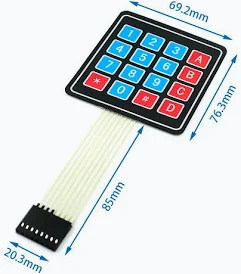
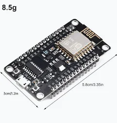

# Matriz LED 8x8 con ESP8266 - Control Web, Keypad y Pantalla OLED

## 📝 Descripción breve

Proyecto completo que integra una matriz NeoPixel 8x8, un ESP8266, un keypad físico 4×4 y una pantalla OLED I2C, todo sincronizado con una interfaz web en tiempo real. El sistema permite controlar la matriz desde el navegador o desde el keypad, mostrando siempre el estado actualizado tanto en la web como en el dispositivo.

## ✨ Características principales

### 🔵 Control desde la web

* Matriz 8×8 completamente colore.
* Permite la selección de color.
* Pintado y borrado de cualquier pixel de la matriz.
* Reinicio completo de los colores de la matriz.
* Sincronización cada 0,5 s con la matriz real.

### 🟢 Control desde el keypad físico

Esta es la matriz keypad 4x4 empleada en el proyecto. En la matriz led física se muestra un led encendido parpadeando en gris, que actúa como un cursor y empleando ciertas teclas asignadas, podemos realizar lo siguiente:

* 2 → Mover cursor arriba  
* 8 → Mover cursor abajo  
* 4 → Mover cursor izquierda  
* 6 → Mover cursor derecha  
* 5 → Pintar / borrar sin mover el cursor  
* 9 → Cambiar color  
* 7 → Reiniciar matriz  

### 🟣 Pantalla OLED SSD1306

* Esta pantalla muestra siempre el color actual.
* Si se pulsa la tecla 9 en la matriz keypad, cambia el color seleccionado para pintar los led de la matriz y se muestra en la pantalla.
* Si se pulsa la tecla 7 en la matriz keypad, se muestra un mensaje "Reiniciando matriz..." y limpia la matriz de colores, apagando todos los leds.
* Todo se actualiza en tiempo real, tanto la pantalla física como en la selección de colores en la web.

### 🧩 Hardware utilizado

* ESP8266 (NodeMCU)  

* Matriz NeoPixel 8×8 WS2812B  

* Pantalla OLED I2C SSD1306  

* Matriz Keypad 4×4  

* Cables Dupont  

🚀 Cómo desplegar el proyecto

  1.Instalar Arduino IDE.

  2.Añadir soporte para ESP8266.

  3.Instalar las librerías:

    Adafruit NeoPixel

    Adafruit GFX

    Adafruit SSD1306

  4.Configurar tu SSID y contraseña WiFi.

  5.Subir el sketch al ESP8266.

  6.Conectar a la IP mostrada por el ESP8266.

¡Listo!

💡 Autores

David Lorente Wagner
Pablo Javier Montoro Bermúdez
